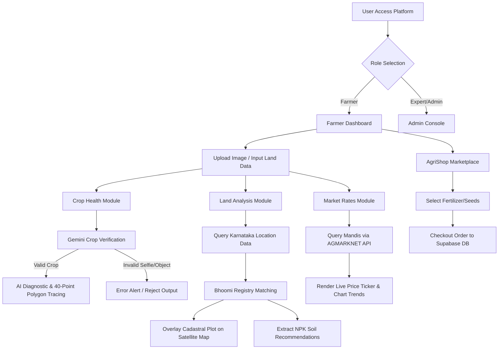

# AgriSmart: AI-Powered Smart Agriculture Platform
## Academic Project Presentation Guide (Slide-by-Slide Outline)

---

### **1. Introduction**
*   **Overview:** AgriSmart is an advanced, localized AgTech platform designed to integrate Artificial Intelligence, GIS Cadastral mapping, live government APMC mandi rates, and database services into a unified portal.
*   **Vision:** To digitize farm diagnostics, optimize yield productivity, and democratize access to agricultural intelligence.
*   **Target Audience:** Indian agricultural enterprises, small-to-midscale farmers (with a primary focus on Karnataka state), and agricultural experts/extension officers.
*   **Core USP:** High-precision Google Gemini AI analysis localized natively in Kannada and English, alongside interactive cadastral land maps and live APMC market ticker indices.

---

### **2. Problem Statement**
*   **Inefficient Pathogen Management:** Crop diseases go undetected until late stages, causing up to 20-30% loss of seasonal yields. Existing computer vision solutions are rigid and fail under complex background noise.
*   **Bureaucratic Hurdles in Land Records:** Farmers struggle to quickly cross-check official land boundaries and khata records (like the state's Bhoomi portal) before seasonal leasing or crop planning.
*   **APMC Mandi Price Asymmetry:** Farmers lack real-time access to live market rates, making them vulnerable to middleman negotiations. They cannot visualize seasonal price patterns to time their harvests.
*   **Linguistic & Connectivity Gaps:** Modern agricultural software is predominantly in English and requires high-speed networks, ignoring regional farmers who operate in poor signal zones.
*   **Fragmented Systems:** Procurement of seeds/pesticides, land records, weather advice, and AI diagnosis exist on separate portals, causing high friction.

---

### **3. The Solution**
*   **AgriSmart Platform:** A comprehensive multi-role web platform that merges AI-driven precision agriculture, government record validation, live market tickers, and e-commerce into a single application.
*   **Pathogen Classifier & Leaf Polygon Tracing:** Leverages Gemini AI to identify plant diseases, filter out non-plant images (selfies/animals), and trace leaf boundaries with a high-precision 40-point perimeter polygon.
*   **Bhoomi Land Validation Node:** Uses survey/hissa numbers to query owner details, land size, and overlays field boundaries on dynamic Leaflet satellite maps.
*   **Live APMC Ticker & Interactive Charting:** Connects to central Agmarknet databases to fetch live APMC rates, featuring price charts showing seasonal volatility patterns.
*   **Linguistic & Offline Accessibility:** Offers complete translation support for English and Kannada, offline banner indicators, and an AI conversational buddy.

---

### **4. Project Objectives**
*   To build an intelligent, multi-model AI diagnostic engine for crop disease identification and leaf perimeter extraction.
*   To integrate simulated cadastral land mapping matching the official government record formats (Bhoomi & Dishank).
*   To pipeline real-time market data from AGMARKNET API endpoints to eliminate middleman price exploitation.
*   To support multi-role authentication distinguishing between Farmers and Admins/Experts with secure host validation.
*   To develop a localized (Kannada/English) user interface equipped with offline state banners.
*   To create a marketplace for certified seed, fertilizer, and pest treatment procurement.

---

### **5. Literature Survey**
*   **System A: Deep Learning CNNs for Plant Disease Detection**
    *   *Limitations:* Excellent on isolated datasets but suffers in accuracy when background objects (soil, hands, shadows) are visible.
    *   *AgriSmart Enhancement:* Employs Generative Multi-modal LLMs (Gemini) which ignore background noise, detect growth stages, and trace precise leaf perimeters dynamically.
*   **System B: Government APMC / Agmarknet Portals**
    *   *Limitations:* Rigid tables, no search autocompletion, lacks interactive visualizations, and has no predictive seasonal trend insights.
    *   *AgriSmart Enhancement:* Uses geocoding search for mandis, live ticker marquees, and interactive historical area charts.
*   **System C: Bhoomi / Dishank Mobile Apps**
    *   *Limitations:* Native apps that are hard to navigate, lacking crop recommendation capabilities or soil condition overlays.
    *   *AgriSmart Enhancement:* Combines land survey ownership records with dynamic soil telemetry (NPK/pH) and personalized crop matching.

---

### **6. Methodology & Workflow**

---

### **7. Tools & Technology Used**
*   **Frontend Library:** React.js (v18) with TypeScript (strict type definitions for safety).
*   **Build Tool:** Vite for fast module replacements and optimized bundles.
*   **UI & Styling:** TailwindCSS for custom glassmorphic cards, CSS keyframes for price ticker marquee, and Framer Motion for slides transition.
*   **Generative AI Engine:** Google Generative AI SDK (`@google/generative-ai` utilizing `gemini-1.5-flash` and `gemini-1.5-pro` models).
*   **Backend & DB:** Supabase Serverless suite providing PostgreSQL databases, Auth triggers, and order records storage.
*   **Mapping:** Leaflet.js map controller with Esri World satellite tiles.
*   **Data Visualization:** Recharts API for APMC historical price graphs and dashboard crop distributions.
*   **External Feeds:** Open-Meteo Geocoding API (for district autocomplete) and AGMARKNET API (for commodity pricing).

---

### **8. System Design & Architecture**
*   **Architecture Pattern:** Three-Tier Web Architecture:
    1.  *Presentation Layer (Client-Side React SPA):* Renders the telemetry dashboards, checkout forms, and Leaflet map panels.
    2.  *Application Layer (Serverless Edge APIs):* Edge calls directed to Google Gemini (vision and text models) and Agmarknet API endpoints.
    3.  *Data Layer (Supabase DB):* Stores authentication credentials, user profiles, shop inventory, and order checkouts.
*   **State Management:** Context API patterns (`AuthContext`, `RoleContext`, `LanguageContext`, `FarmContext`, `ClassifierContext`) to propagate settings across components without prop-drilling.

---

### **9. Implementation Details**
*   **Crop Health Diagnostic:**
    *   Images are converted to base64 on the client, packaged into generative prompts, and dispatched.
    *   Strict JSON generation instructions enforce Gemini to return structured diagnosis schemas for UI rendering.
*   **Official Bhoomi Land Simulator:**
    *   Generates a deterministic hash from a combined Survey/Hissa location string.
    *   Produces specific cadastral coordinates matching the Pashupatihala, Kundgol, Dharwad APMC sector (Survey 201/5) using Leaflet.
*   **APMC Price Pipeline:**
    *   Calls AGMARKNET's API resources using a CORS proxy.
    *   If government databases time out, fallback JSON streams represent baseline prices for Chilli, Corn, Soybean, Cotton, Wheat, and Tomato.

---

### **10. Application & Uses**
*   **Instant Fungal & Pest Diagnosis:** Farmers capture photos of leaves in the field to receive instant biological or conventional treatments.
*   **Land Ownership Verification:** Extension officers and farmers verify land extent and khata details when negotiating leases.
*   **APMC Market Price Optimization:** Farmers query adjacent market APMCs (e.g., Dharwad APMC vs Guntur APMC) to transport their yield to the highest-paying APMC.
*   **AgriShop E-Commerce:** Convenient, direct shopping for quality seeds and fertilizers.
*   **Subsidy & Benefit Discovery:** Direct, matching filters that prevent farmers from missing deadlines for state benefits (e.g. Krishi Bhagya).

---

### **11. Project Advantages**
*   **Linguistic Accessibility:** Eliminates barriers for rural farmers by offering complete native Kannada translations.
*   **AI Guardrails:** Ensures model computational time is not wasted on non-agricultural images.
*   **Background Noise Immunity:** Boundary-tracing polygons ensure high-accuracy diagnostic reports.
*   **Offline Awareness:** Immediately updates the user on network degradation.
*   **Flexibility:** Allows experts to load custom Teachable Machine URLs, making it highly customizable.

---

### **12. Future Scope**
*   **Capacitor.js Integration:** Compile the codebase into native Android packages (.apk) to utilize local camera APIs and native offline databases.
*   **Live IoT Node Telemetry:** Connect physically to agricultural hardware (soil moisture sensors, weather stations) via Supabase edge functions.
*   **ML Yield Estimations:** Track historical satellite indices (NDVI) to calculate yield forecasts based on crop canopy area.
*   **Dynamic WMS Mapping:** Connect the Leaflet map panel directly to active Web Map Services (WMS) run by the Survey Settlement & Land Records Dept. of Karnataka.

---

### **13. Key References**
1.  **Google Generative AI Documentation:** Gemini API reference models (Generative AI Developer Guide).
2.  **Open Government Data Portal (data.gov.in):** Agmarknet Commodity Arrival and Price Daily Feeds (dataset resource ID: `9ef273d1-c1aa-42da-ad35-3c544bd3503c`).
3.  **Bhoomi Land Records System, Karnataka:** Technical layout definitions for RTC/Pahani (Survey Settlement & Land Records).
4.  **Leaflet.js Mapping Library:** GIS Web Mapping API & Esri Tile integration.
5.  **Open-Meteo API:** Geocoding autocomplete queries and hyper-local climate models.
